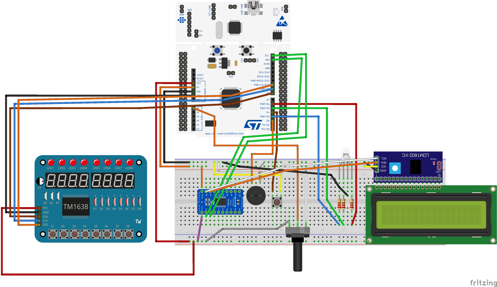
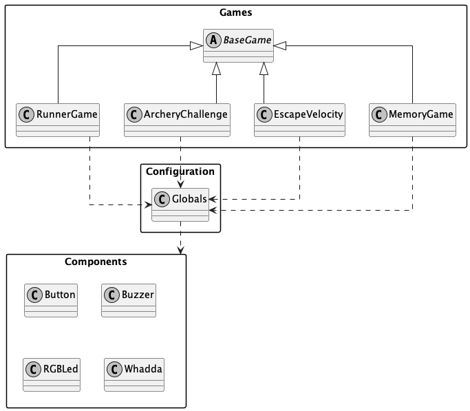
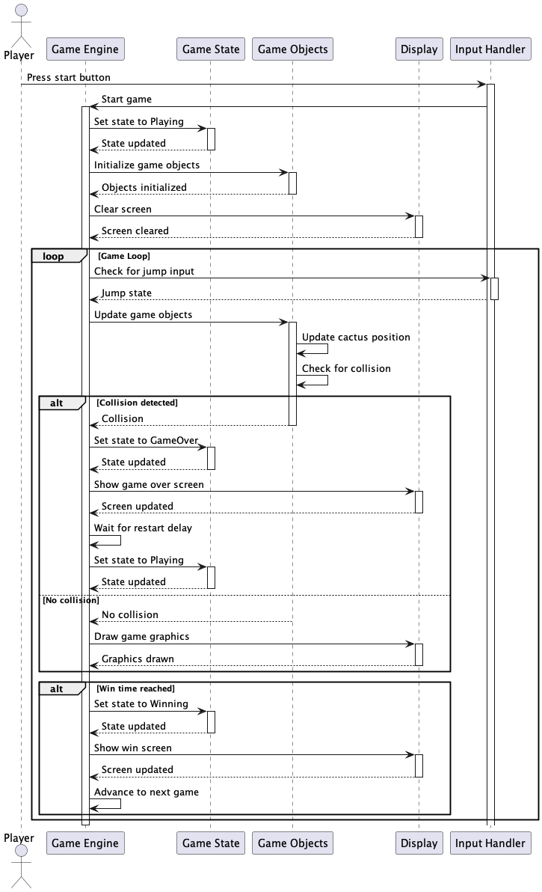
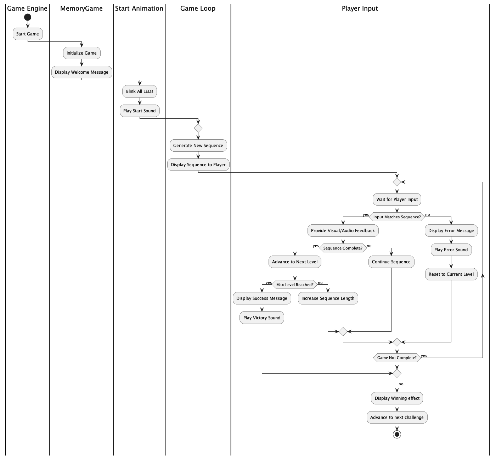
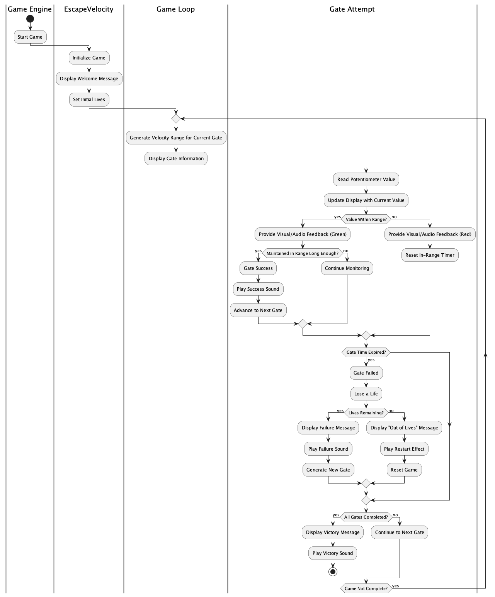
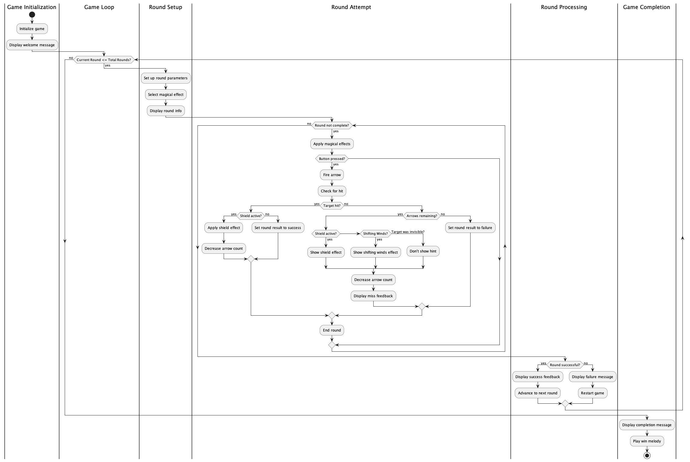

# Embedded Programming

In this document, I will present the final wiring used, systems architecture, sequence diagrams, and final thoughts.

## Wiring Diagram and Pins

The following diagram presents the final wiring configuration used in the project. The components used for the games include:

- LCD screen
- Push button
- Buzzer
- Potentiometer
- TM1638 Led&Key module
- RGB LED

The pins are defined in `src/Pins.h` file. The following table presents the pins used for each component:

| Component | Pin |
|-----------|-----|
| LCD screen | D14, D15|
| Push button | D4 |
| Buzzer | D2 |
| RGB LED | D6, D3, D5 |
| TM1638 Led&Key module | D8, D9, D10 |
| Potentiometer | A0 |

**Note:** The diagram above is created using Fritzing. You can find the source code in `docs/diagrams/wiring.fzz`. Credit goes to my classmate Ignat for showing me how to import custom components (like Whadda or buzzer) to Fritzing.

## Systems Architecture

The following diagram presents the systems architecture of the project. 

The project follows a well-structured organization:

1. `main.cpp` serves as the entry point, initializing games and the UI.
2. Each game is implemented in its own file, following an object-oriented approach:
   - A base class defines the common interface and shared functionality
   - Derived classes implement specific game logic
   - Each game overrides the `run` function, which serves as the main game loop. When the function returns `true`, the game is finished and the player can advance to the next game.
   - The base class provides utilities like `hasElapsed` for time-based operations

Game classes are located in the `src/games` folder. Corresponding game headers are in `include` folder. Each game has:
- A class definition
- A namespace with configuration
- Game-specific constants

To promote code reusability and abstraction, utility classes are implemented in the `src/components` folder:
- `Button`: Handles push button interactions
- `Buzzer`: Controls the buzzer
- `RGBLed`: Manages the RGB LED
- `Whadda`: Wrapper for the `TM1638` module with helper functions

All games and components are implemented as non-blocking, allowing the program to handle multiple tasks simultaneously. Game state variables track the current state, updated in the main loop using `millis()` for time-based events.

To avoid extern declarations, a `Globals` class in `src/Globals.h` stores all global variables, simplifying game implementation by requiring only `Globals.h` and the corresponding game header file.

**Note:** The diagram above is created using plantuml. You can find the source code in `docs/diagrams/ClassDiagram.puml`.

## Game Diagrams

This section presents the sequence diagrams and explains the flow of each game.

### Runner Game

The Runner Game follows a continuous gameplay loop where the player must avoid obstacles:
1. The game initializes with a player character and randomly generated obstacles
2. The player can jump up using the push button
3. Obstacles move from right to left across the screen
4. The game continuously checks for collisions between the player and obstacles
5. The score increases as the player survives longer
6. The game ends when a collision is detected, displaying the final score
7. If player survives long enough, the game ends and the player wins, advancing to the next game

**Note:** The diagram above is created using plantuml. You can find the source code in `docs/diagrams/RunnerGame.puml`.

### Memory Game

The Memory Game challenges players to remember and repeat a sequence:
1. The game starts by displaying a sequence of LED patterns
2. The player must repeat the sequence using the push button
3. Each successful round adds a new pattern to the sequence (sequence length increases based on the level)
4. The game verifies the player's input against the correct sequence
5. If the player makes a mistake, current sequence is shown again and the player can try again
6. The final score is based on the longest sequence successfully completed

**Note:** The diagram above is created using plantuml. You can find the source code in `docs/diagrams/MemoryGame.puml`.

### Escape Velocity

Escape Velocity is a timing-based game where players must achieve perfect timing:
1. The game displays a range of numbers on the LCD screen. Numbers in range are determined by current level. Each round is 10 seconds
2. The player must align current potentiometer value with the target number range
3. Once aligned, the player must remain in the range for 3 seconds.
4. If the player moves out of the range, error effect is shown. Player can then try adjust value, if they have remaining time.  
5. Visual feedback (RGB LED) indicates if player is in range or not.
6. If player didn't manage to stay in range for 3 seconds and the time runs out, player loses a life and presented with different range of numbers.
7. If player manages to stay in range for 3 seconds, player wins the round and presented with different range of numbers. To advance to the next game, player must win 5 rounds.
8. If player loses all 3 lives, game restarts completely

**Note:** The diagram above is created using plantuml. You can find the source code in `docs/diagrams/EscapeVelocity.puml`.

### Archery Challenge

The Archery Challenge tests players' precision and timing:
1. The game generates a random target value.
2. Players use the potentiometer to aim their "arrow"
3. Each round a random magical effect is applied to the target value. Each magical effect can affect the target value in a different way.
4. The game checks if the shot is within the target range
5. If the shot is within the target range, player wins the round and presented with different target value. To advance to the next game, player must win 3 rounds.
6. Each round target value is decreasing to make the game more difficult
7. If the shot is out of the target range, player loses a life and presented with a hint on the LCD screen.
8. If player loses all 3 lives, game restarts completely

**Note:** The diagram above is created using plantuml. You can find the source code in `docs/diagrams/ArcheryChallenge.puml`.